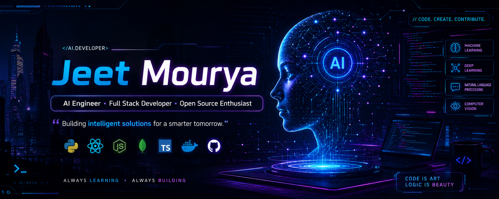

<p align="center">
  
</p>

<div align="center">

# 👋 Hi, I'm Jeet Mourya

### 💻 AI Engineer • Full Stack Developer • B.Tech IT @ MITS Gwalior


<br>


</div>

---

# 🚀 About Me


🎓 B.Tech Information Technology Student at **MITS Gwalior**

🤖 Passionate about Artificial Intelligence, Machine Learning and Generative AI.

💡 I love building intelligent applications that solve real-world problems.

💻 Currently exploring

- Artificial Intelligence
- Machine Learning
- Large Language Models (LLMs)
- Full Stack Development
- Cloud Technologies

🌱 Always learning something new.

🎯 Goal

Become an AI Engineer and contribute to impactful products used by millions.

---

# 💻 Tech Stack

## 👨‍💻 Programming Languages

<p align="center">


</p>

---

## ⚙️ Frameworks & Libraries

<p align="center">


</p>

---

## 🤖 AI / ML

<p align="center">


</p>

---

## 🗄 Database

<p align="center">


</p>

---

## 🛠 Tools

<p align="center">


</p>

---

# 🔥 Current Focus

✅ Generative AI

✅ Large Language Models

✅ Retrieval-Augmented Generation (RAG)

✅ Full Stack Development

✅ Open Source Contributions

✅ DSA & Problem Solving

---

# 🚀 Featured Projects

<div align="center">

| Project | Description | Tech Stack |
|---------|-------------|------------|
| 🧠 **AI Text Morph** | AI-powered Text Summarization & Paraphrasing Platform | Python • Streamlit • Hugging Face • Groq API |
| 🎓 **MITS Academic Hub** | Smart Student Result Portal with Admin Dashboard | HTML • CSS • JavaScript • Node.js |
| 🤖 **Upcoming AI Projects** | AI Resume Analyzer • AI Interview Assistant • Smart PDF Chatbot | Python • LLMs • AI |

</div>

---

# 🧠 AI Text Morph

### 📌 Advanced Text Summarization & Paraphrasing Platform

An AI-powered web application developed during the **Infosys Springboard AI Internship**, designed to summarize and paraphrase text using modern transformer models.

### ✨ Key Features

- 📝 AI Text Summarization
- 🔄 Intelligent Text Paraphrasing
- 📖 Reading Time Analytics
- 📥 Download Generated Output
- 🎨 Modern Responsive UI
- ⚡ Fast Processing with Groq API
- 🤖 Hugging Face Transformer Models

### 🛠 Tech Stack

<p align="center">


</p>

---

# 🎓 MITS Academic Hub

### 📌 Smart Student Result Portal

A modern Result Management Platform specially built for students of **MITS Gwalior**.

### ✨ Features

- 🔍 Result Search
- 📚 Semester Selection
- 👨‍🎓 Student Dashboard
- 🛡 Admin Dashboard
- 🔒 Secure Authentication
- 📱 Mobile Responsive
- 🎨 Modern Glass UI

### 🛠 Tech Stack

<p align="center">


</p>

---

# 💼 Experience

## 🏢 Infosys Springboard Virtual Internship 6.0

### 🤖 Artificial Intelligence Intern

📅 2026

Worked on AI-powered NLP applications using modern Transformer Models.

### Responsibilities

✔ Developed AI-based applications

✔ Implemented Text Summarization

✔ Built NLP Pipelines

✔ Worked with Hugging Face Models

✔ Integrated Groq API

✔ Developed Modern Streamlit UI

---

# 🏆 Certifications

🥇 Infosys Springboard Virtual Internship

🤖 Artificial Intelligence

🏅 AI Text Morph Project Completion

📜 Python Programming

📜 NLP Fundamentals

---

# 🎯 2026 Goals

- 🚀 Master Data Structures & Algorithms
- 🤖 Build 15+ AI Projects
- 🌍 Contribute to Open Source
- 💼 Secure a Top Software Internship
- 📚 Learn System Design
- ☁️ Master Cloud Technologies
- 🐳 Learn Docker & Kubernetes
- ⚛️ Become MERN Stack Developer

---

# 📚 Currently Learning

```text
🤖 Generative AI

🧠 Large Language Models (LLMs)

📦 Vector Databases

🔍 Retrieval-Augmented Generation (RAG)

⚛️ React.js

🌐 Node.js

🐳 Docker

☁️ Cloud Computing

📈 Advanced DSA
```

---

# 📊 GitHub Statistics

<div align="center">


</div>

---

# 🔥 GitHub Streak

<div align="center">


</div>

---

# 🏆 GitHub Achievements

<div align="center">


</div>

---

# 📈 Contribution Graph

<div align="center">


</div>

---

# ⚡ Coding Profiles

<div align="center">

<a href="https://github.com/JeetMourya">

</a>

<a href="https://leetcode.com/">

</a>

<a href="https://www.hackerrank.com/">

</a>

<a href="https://www.codechef.com/">

</a>

<a href="https://codeforces.com/">

</a>

</div>

---

# 💡 Development Philosophy

```text
✔ Write Clean Code

✔ Build Real Projects

✔ Learn Every Day

✔ Share Knowledge

✔ Never Stop Improving
```

---

# 📅 2026 Learning Roadmap

| Technology | Status |
|------------|--------|
| Python | ✅ |
| C++ | ✅ |
| Java | ✅ |
| HTML/CSS | ✅ |
| JavaScript | ✅ |
| Git & GitHub | ✅ |
| Streamlit | ✅ |
| Flask | ✅ |
| Hugging Face | ✅ |
| NLP | ✅ |
| LLMs | 🔄 Learning |
| React | 🔄 Learning |
| Node.js | 🔄 Learning |
| Docker | ⏳ Planned |
| Kubernetes | ⏳ Planned |
| AWS | ⏳ Planned |

---

# 📈 Weekly Development Breakdown

```text
Python            ████████████░░░░ 70%

Java              █████████░░░░░░ 55%

C++               ██████████░░░░░ 60%

JavaScript        ███████░░░░░░░░ 40%

AI / ML           █████████████░░ 80%

DSA               █████████░░░░░░ 55%

Full Stack        ███████░░░░░░░░ 45%
```

---

# 🌟 Quote I Live By

> **"Code is not just about solving problems. It's about creating possibilities."**

---

---

# 🐍 Contribution Snake

<div align="center">


</div>

---

# 🌐 Connect With Me

<div align="center">

<a href="https://github.com/JeetMourya">

</a>

<a href="https://linkedin.com/in/YOUR_LINKEDIN">

</a>

<a href="mailto:YOUR_EMAIL@gmail.com">

</a>

<a href="https://portfolio-link.vercel.app">

</a>

</div>

---

# 💼 Open to Opportunities

<div align="center">

🚀 Looking for

✔ AI/ML Internships

✔ Software Development Internships

✔ Open Source Contributions

✔ Full Stack Development Projects

✔ AI Research Collaborations

</div>

---

# ⚡ Fun Facts

- 🤖 I enjoy building AI-powered applications.
- 📚 I love learning new technologies every day.
- 💡 I believe consistency beats talent.
- ☕ Coffee + Coding = Productivity.

---

# 📊 Profile Summary

<div align="center">


</div>

---

# 🏅 Random Dev Quote

<div align="center">


</div>

---

# 👀 Visitor Counter

<div align="center">


</div>

---

<div align="center">

## ⭐ Thanks for Visiting My Profile ⭐

*"Turning Ideas into Intelligent Applications."*

### If you like my work, consider giving a ⭐ to my repositories.


</div>
